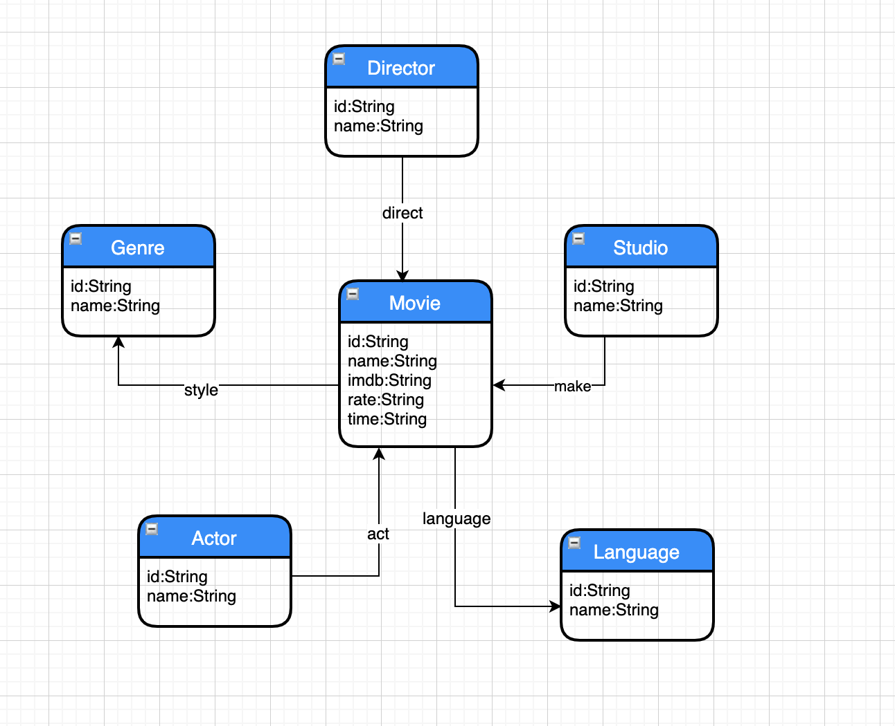
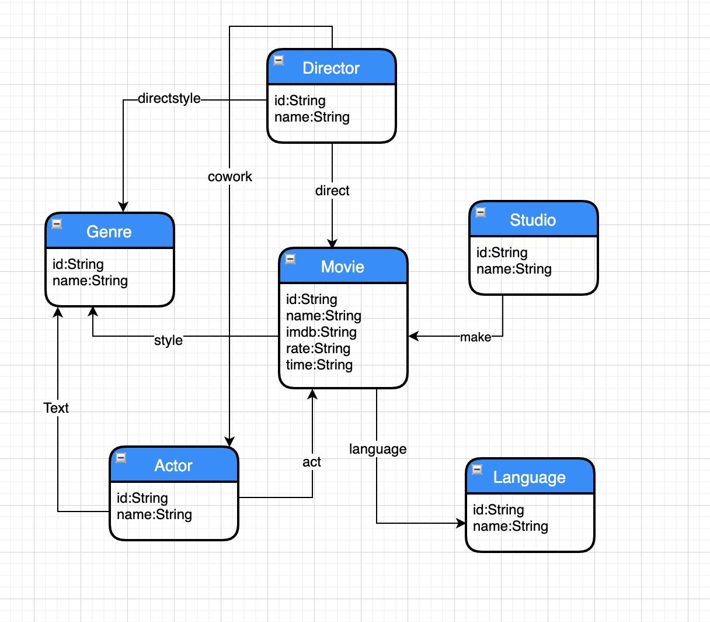
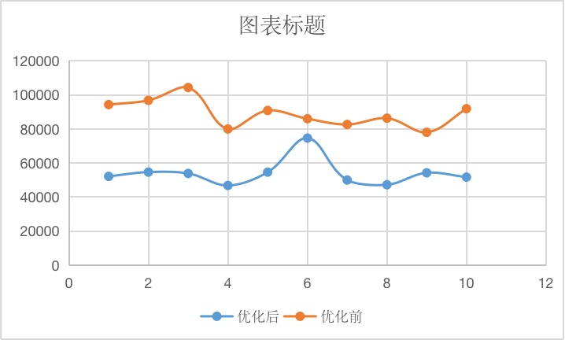
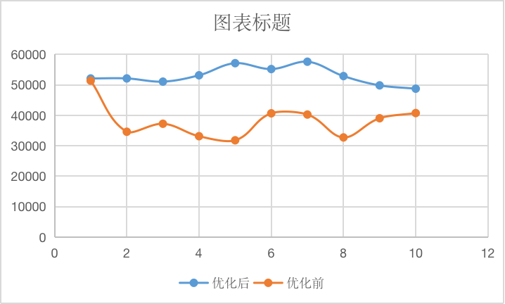
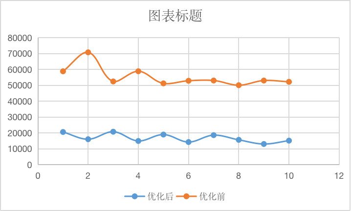

## neo4j

#### ETL

​	爬虫获得的CSV有几十兆。对CSV进行处理时，首先尝试了pandas的merge，但是由于文件过大，每次跑到一半就会自动挂掉。查资料看到可以分块来解决，但是感觉过于麻烦。最后是用kettle，把CSV先导入MySQL中，在数据库中处理完之后再导出CSV，超级快。

#### E-R

​	优化之前的E-R图没有在Actor和Director，Actor和Genre，Director和Genre之间加边，虽然在查找的时候也能找到，但是还是慢了一些。

	

​	为了提高速度，采取了冗余存储。多加了一些边，速度有明显的提升。

​	下图是某三条语句连续执行10次时，优化前和优化后耗时的比较。

#### 

#### 存储模型

​	刚开始数据导入是用Python一条一条往neo4j里插的，速度非常慢，一个小时只能插4万条数据，如果刚好又要进行什么修改就会非常麻烦。后来找到了用CSV快速导入的方法——neo4j-admin命令。上一步对CSV进行处理之后，这一步只需要几十秒的时间，数据就能完全导入。

#### 查询和统计程序

​	数据查询用Java和flask各写了一份，最后用的是flask，因为添加“时间”属性比较方便。（productTry.py是处理CSV的脚本，insert.txt是是用neo4j-admin的命令，app.py是flask的数据查询）

#### 